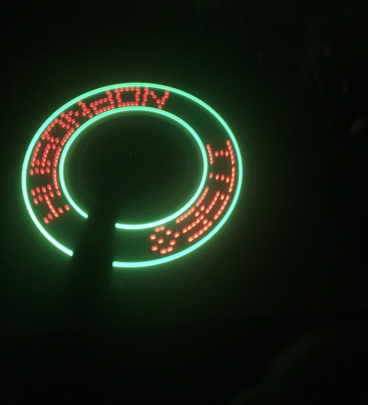
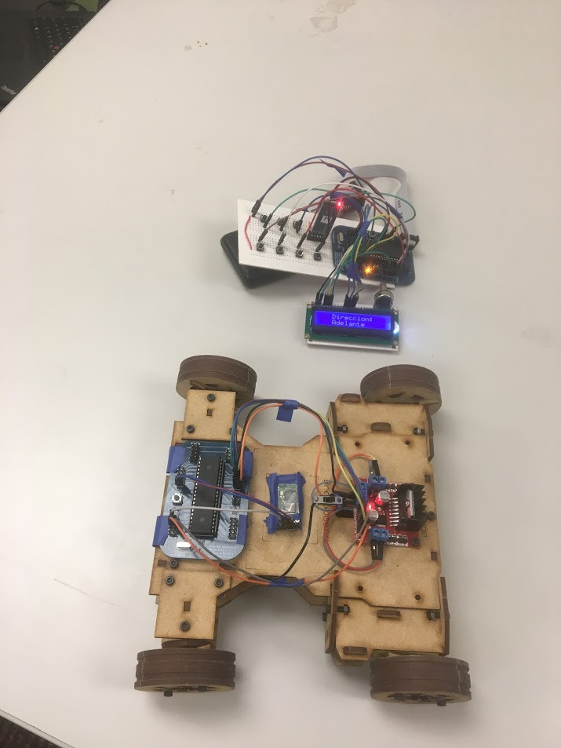

# Microcontrollers_Lab_Codes
Codes related to Microcontrollers Laboratory class. ASM Only

## Projects

### LED POV display configurable via Bluetooth.

- Configurable clock.
- Use of differente peripherals including Timers, ADC and Interrupts.
- UART communication between two ATmega16s to HC-05 to transmit and receive information via Bluetooth.

### Bluetooth Controlled Car

- Remote Controlled car.
- Use of differente peripherals including Timers,Interrupts.
- UART communication between two ATmega16s to HC-05 to transmit and receive information via Bluetooth.
